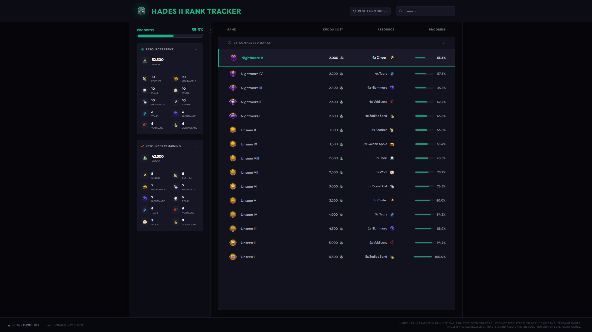

# Hades II Rank Tracker



A simple web app designed to help players track their progress towards unlocking all ranks in Hades II.

## 🚀 Live App
You can access the live application here: [Hades II Rank Tracker](https://hades-ii-rank-tracker-54268731549.us-west2.run.app/)

## ✨ Features
- **Progress Tracking:** Monitor your current rank and track progress towards completion of all ranks.
- **Resource Management:** View exactly how many Kudos and specific resources are required for your next rank and for all remaining ranks.
- **Persistent Progress:** Your current rank is saved locally so you can resume tracking at any time.
- **Search & Filter:** Quickly find specific ranks by name or their unique resource requirements.

## 🛠️ How to Use
1. **Select Your Rank:** Click on any rank in the list to set it as your current rank.
2. **View Requirements:** The sidebar will automatically update to show:
   - **Resources Spent:** What you have already spent to reach your current rank.
   - **Resources Remaining:** Remaining requirements for full completion.
3. **Reset Progress:** Use the "Reset Progress" button in the header to start over from "Unranked".

## 📦 Tech Stack
- React 18+
- TypeScript
- Tailwind CSS
- Framer Motion (for animations)
- Lucide React (for iconography)

## 🛠️ Local Development

To run this project locally:

1. **Install dependencies:**
   ```bash
   npm install
   ```

2. **Start the development server:**
   ```bash
   npm run dev
   ```

3. **Build for production:**
   ```bash
   npm run build
   ```

---

### Disclaimer
Hades II Rank Tracker is an unofficial, fan-developed project that is not affiliated with or endorsed by Supergiant Games. Hades II and all related characters and assets are the sole property of Supergiant Games.
